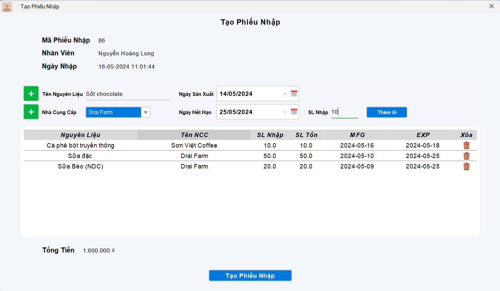
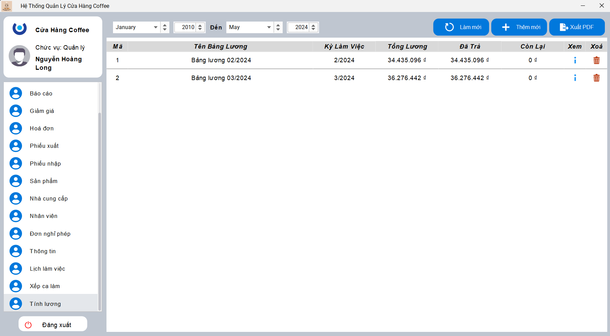

# Quản lý cửa hàng bán coffee

***

## Giới thiệu

Dự án Quản lý cửa hàng bán coffee là một hệ thống toàn diện giúp các cửa hàng coffee quản lý mọi khía cạnh hoạt động của họ một cách hiệu quả và chính xác. Hệ thống này được thiết kế để hỗ trợ nhiều nhóm người dùng khác nhau, bao gồm quản trị viên, quản lý, nhân viên kho và nhân viên bán hàng, mỗi nhóm có các chức năng riêng biệt để thực hiện công việc của mình.

Với giao diện thân thiện và dễ sử dụng, hệ thống này cung cấp các tính năng quản lý tài khoản, phân quyền, thống kê bán hàng, quản lý kho, nhập xuất hàng hóa, và nhiều chức năng khác. Dự án này sử dụng ngôn ngữ lập trình Java và được xây dựng với mục tiêu cải thiện hiệu quả hoạt động của các cửa hàng coffee, từ đó giúp tối ưu hóa quá trình vận hành và tăng cường trải nghiệm của khách hàng.

Dưới đây là thông tin chi tiết về các nhóm người dùng và cách đăng nhập vào hệ thống.

## Mục lục
- [Quản lý cửa hàng bán coffee](#quản-lý-cửa-hàng-bán-coffee)
  - [Giới thiệu](#giới-thiệu)
  - [Mục lục](#mục-lục)
  - [Cài đặt và chạy dự án](#cài-đặt-và-chạy-dự-án)
  - [Ngôn ngữ lập trình và công nghệ sử dụng](#ngôn-ngữ-lập-trình-và-công-nghệ-sử-dụng)
  - [Nhóm đối tượng sử dụng](#nhóm-đối-tượng-sử-dụng)
  - [Thông tin đăng nhập](#thông-tin-đăng-nhập)
  - [Giao diện (Interface)](#giao-diện-interface)
    - [Đăng nhập](#đăng-nhập)
    - [Admin](#admin)
    - [Quản lý](#quản-lý)

- **Ngôn ngữ lập trình:** Java

## Nhóm đối tượng sử dụng

- **Admin:** Quản lý tài khoản, Phân quyền
- **Quản lý:** Thống kê, Sản phẩm, Giảm giá, Quản lý nhân viên, Chấm công, Tính lương, Duyệt đơn nghĩ phép
- **Nhân viên kho:** Kho hàng, Nhập hàng, Xuất hàng, Nhà cung cấp
- **Nhân viên bán hàng:** Bán hàng

## Thông tin đăng nhập

| Vai trò         | Tên tài khoản | Mật khẩu   |
|-----------------|---------------|------------|
| **Admin**       | admin         | Admin123.  |
| **Quản lý**     | longbott      | Long123.   |
| **Nhân viên kho** | vminhthuan    | Thuan123.  |
| **Bán hàng**    | ducanh        | Anh123.    |

## Giao diện (Interface)

### Đăng nhập

  

### Admin

  
  <b>Tài khoản</b>

  
  <b>Phân quyền</b>

### Quản lý

  
  <b>Bán hàng</b>

  
  <b>Kho hàng</b>

  
  <b>Giảm giá</b>

  
  <b>Nhập hàng</b>

  
  <b>Xuất hàng</b>

  
  <b>Sản phẩm</b>

  
  <b>Lịch làm việc, chấm công</b>

  
  <b>Tổng lương theo kỳ làm việc</b>

  
  <b>Lương chi tiết của mỗi nhân viên</b>

  
  <b>Báo cáo cuối ngày về bán hàng</b>

  
  <b>Báo cáo cuối ngày về thu chi</b>

  
  <b>Báo cáo cuối ngày về sản phẩm</b>

  
  <b>Báo cáo bán hàng theo thời gian kiểu hiển thị bảng báo cáo</b>

  
  <b>Báo cáo bán hàng theo thời gian kiểu hiển thị biểu đồ</b>

  
  <b>Báo cáo bán hàng theo lợi nhuận kiểu hiển thị báo cáo</b>

  
  <b>Báo cáo bán hàng theo lợi nhuận kiểu hiển thị biểu đồ</b>

  
  <b>Báo cáo nhân viên</b>

  
  <b>Báo cáo sản phẩm kiểu hiển thị biểu đồ</b>

  
  <b>Báo cáo sản phẩm kiểu hiển thị báo cáo</b>

  
  <b>Báo cáo xuất nhập tồn</b>

  
  <b>Báo cáo tài chính kiểu hiển thị biểu đồ</b>

  
  <b>Báo cáo tài chính kiểu hiển thị bảng báo cáo</b>

